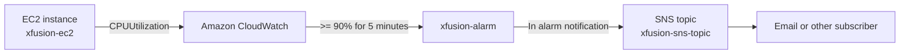

# Setting Up an EC2 Instance and CloudWatch Alarm

## Problem Statement

The Nautilus DevOps team needs to launch an Ubuntu EC2 instance for an application and monitor its CPU utilization with Amazon CloudWatch. The alarm must notify the existing SNS topic when the instance reaches a high CPU threshold.

As a member of the Nautilus DevOps Team, your task is to perform the following:

- Launch an Ubuntu EC2 instance named `xfusion-ec2`.
- Create a CloudWatch alarm named `xfusion-alarm`.
- Monitor the instance's `CPUUtilization` metric using the `Average` statistic.
- Trigger the alarm when CPU utilization is greater than or equal to `90%` for one consecutive 5-minute period.
- Send alarm notifications to the existing SNS topic named `xfusion-sns-topic`.
- Verify the instance and alarm configuration.

The commands below use the AWS CLI and assume that credentials with permissions for EC2, CloudWatch, SNS, and SSM Parameter Store are already configured.

## Prerequisites & Architecture Overview

- AWS Region: `us-east-1` in the examples below
- AMI: Latest Ubuntu Server 24.04 LTS AMI from the AWS public SSM parameter
- Instance Name: `xfusion-ec2`
- Instance Type: `t3.micro`
- Alarm Name: `xfusion-alarm`
- Metric: `AWS/EC2` / `CPUUtilization`
- Statistic: `Average`
- Period: `300` seconds (5 minutes)
- Threshold: Greater than or equal to `90`
- Evaluation Periods: `1`
- SNS Topic: `xfusion-sns-topic`

The instance publishes standard CPU metrics to CloudWatch automatically. CloudWatch evaluates those metrics against the alarm condition and changes the alarm state when the condition is met. When the alarm enters the `ALARM` state, CloudWatch publishes a notification to the configured SNS topic.



## Solution

### Method 1: AWS Management Console

#### Step 1: Launch the EC2 Instance (`xfusion-ec2`)

Go to the EC2 Console and click **Launch instance**.

Configure the instance as follows:

- **Name:** `xfusion-ec2`
- **Application and OS Images:** Ubuntu Server 24.04 LTS (64-bit)
- **Instance type:** `t3.micro` or another appropriate small instance type
- **Key pair:** Select an existing key pair, or choose to proceed without one if SSH access is not required
- **Network settings:** Select the required VPC and subnet, then select or create a suitable security group
- **Storage:** Keep the default root volume unless the application requires additional storage

Review the configuration and click **Launch instance**. Copy the instance ID after the instance is created.

#### Step 2: Confirm the SNS Topic

Open the Amazon SNS Console and go to **Topics**. Find `xfusion-sns-topic` and confirm that it exists.

Open the topic's **Subscriptions** tab and confirm that at least one subscription is present and confirmed. An alarm can publish successfully even when no subscription is confirmed, but no recipient will receive the notification in that case.

#### Step 3: Create the CloudWatch Alarm (`xfusion-alarm`)

1. Open the CloudWatch Console and go to **Alarms** -> **All alarms**.
2. Click **Create alarm** and choose **Select metric**.
3. Select **EC2** -> **Per-Instance Metrics**.
4. Find the instance named `xfusion-ec2` and select `CPUUtilization`.
5. Configure the metric and conditions:
   - Statistic: `Average`
   - Period: `5 minutes`
   - Threshold type: `Static`
   - Condition: `Greater/Equal (>=)`
   - Threshold: `90`
   - Datapoints to alarm: `1 out of 1`
6. Under **Configure actions**, set the alarm state trigger to **In alarm**.
7. Select the existing SNS topic `xfusion-sns-topic`.
8. Set the alarm name to `xfusion-alarm`.
9. Add a description such as `Alarm when average CPU utilization reaches 90 percent for 5 minutes`.
10. Review the configuration and click **Create alarm**.

#### Step 4: Verify the Configuration

Open `xfusion-alarm` and confirm that:

- The monitored instance is `xfusion-ec2`.
- The metric is `CPUUtilization` in the `AWS/EC2` namespace.
- The statistic is `Average`.
- The period is `5 minutes`.
- The condition is `>= 90`.
- Evaluation uses `1 out of 1` datapoint.
- The alarm action points to `xfusion-sns-topic`.

The initial state may be `INSUFFICIENT_DATA` until CloudWatch receives enough metric data. This is normal for a newly launched instance and usually resolves after the first few metric intervals.

### Method 2: AWS CLI

#### 1. Set the AWS Region

Use the region where the instance and SNS topic should be created. The region must be supplied consistently for EC2, CloudWatch, SNS, and SSM commands.

```bash
export AWS_REGION="us-east-1"
```

Confirm that the CLI can access the account:

```bash
aws sts get-caller-identity --region "$AWS_REGION"
```

#### 2. Find the SNS Topic ARN

CloudWatch requires the topic ARN rather than the topic name. Retrieve the ARN of the existing topic:

```bash
SNS_TOPIC_ARN=$(aws sns list-topics \
  --region "$AWS_REGION" \
  --query "Topics[?ends_with(TopicArn, ':xfusion-sns-topic')].TopicArn | [0]" \
  --output text)

echo "SNS Topic ARN: $SNS_TOPIC_ARN"
```

Check that the variable contains an ARN before creating the alarm:

```bash
test "$SNS_TOPIC_ARN" != "None" && test -n "$SNS_TOPIC_ARN" && echo "SNS topic found"
```

#### 3. Find the Latest Ubuntu AMI

Canonical publishes the current Ubuntu AMI ID through a public SSM Parameter Store path. This avoids hard-coding an AMI ID that may differ between regions.

```bash
UBUNTU_AMI=$(aws ssm get-parameter \
  --name "/aws/service/canonical/ubuntu/server/24.04/stable/current/amd64/hvm/ebs-gp3/ami-id" \
  --region "$AWS_REGION" \
  --query "Parameter.Value" \
  --output text)

echo "Ubuntu AMI: $UBUNTU_AMI"
```

#### 4. Launch the EC2 Instance

Launch a small Ubuntu instance and add the required `Name` tag:

```bash
INSTANCE_ID=$(aws ec2 run-instances \
  --image-id "$UBUNTU_AMI" \
  --instance-type t3.micro \
  --tag-specifications 'ResourceType=instance,Tags=[{Key=Name,Value=xfusion-ec2}]' \
  --region "$AWS_REGION" \
  --query "Instances[0].InstanceId" \
  --output text)

echo "Launched instance: $INSTANCE_ID"
```

Wait for the instance to pass both the EC2 state and system status checks:

```bash
aws ec2 wait instance-running \
  --instance-ids "$INSTANCE_ID" \
  --region "$AWS_REGION"

aws ec2 wait instance-status-ok \
  --instance-ids "$INSTANCE_ID" \
  --region "$AWS_REGION"
```

#### 5. Create the CloudWatch Alarm

A period of `300` seconds represents one 5-minute evaluation window, and `1` evaluation period means one breaching datapoint is enough to enter the `ALARM` state.

```bash
aws cloudwatch put-metric-alarm \
  --alarm-name "xfusion-alarm" \
  --alarm-description "Alarm when average CPU utilization reaches 90 percent for 5 minutes" \
  --metric-name "CPUUtilization" \
  --namespace "AWS/EC2" \
  --statistic "Average" \
  --period 300 \
  --evaluation-periods 1 \
  --threshold 90 \
  --comparison-operator "GreaterThanOrEqualToThreshold" \
  --dimensions "Name=InstanceId,Value=$INSTANCE_ID" \
  --alarm-actions "$SNS_TOPIC_ARN" \
  --region "$AWS_REGION"
```

#### 6. Verify the Instance and Alarm

Display the instance name, state, and ID:

```bash
aws ec2 describe-instances \
  --instance-ids "$INSTANCE_ID" \
  --region "$AWS_REGION" \
  --query "Reservations[0].Instances[0].{Name:Tags[?Key=='Name']|[0].Value,State:State.Name,InstanceId:InstanceId}" \
  --output table
```

Verify the alarm properties and configured action:

```bash
aws cloudwatch describe-alarms \
  --alarm-names "xfusion-alarm" \
  --region "$AWS_REGION" \
  --query "MetricAlarms[0].{Name:AlarmName,State:StateValue,Metric:MetricName,Statistic:Statistic,Period:Period,EvaluationPeriods:EvaluationPeriods,Threshold:Threshold,Action:AlarmActions[0]}" \
  --output table
```

The alarm may initially show `INSUFFICIENT_DATA`. Wait until CloudWatch receives the first datapoint, then query it again:

```bash
aws cloudwatch describe-alarms \
  --alarm-names "xfusion-alarm" \
  --region "$AWS_REGION" \
  --query "MetricAlarms[0].StateValue" \
  --output text
```

## Command Explanations

### `aws sns list-topics`

This command lists SNS topics in the selected region. The JMESPath query selects the ARN whose topic name is `xfusion-sns-topic`, because CloudWatch alarm actions require an ARN.

### `aws ssm get-parameter`

This command reads Canonical's public SSM parameter containing the latest Ubuntu 24.04 AMI ID for the selected region and architecture. AMI IDs are region-specific, so using this parameter is more portable than copying an ID from another region.

### `aws ec2 run-instances`

This command creates the EC2 instance from the selected AMI. The `--tag-specifications` option assigns the `Name` tag used to identify the instance in the console. The command returns the new instance ID for later commands.

### `aws ec2 wait`

The waiter pauses until the instance reaches the requested state. `instance-running` confirms that the instance is running, while `instance-status-ok` also confirms that AWS system and instance status checks have passed.

### `aws cloudwatch put-metric-alarm`

This command creates or updates a CloudWatch alarm.

- `--metric-name CPUUtilization`: monitors the EC2 CPU metric.
- `--namespace AWS/EC2`: identifies the AWS service publishing the metric.
- `--statistic Average`: averages the samples within each period.
- `--period 300`: evaluates a five-minute window.
- `--evaluation-periods 1`: requires one consecutive breaching period.
- `--threshold 90`: sets the CPU threshold to 90 percent.
- `--comparison-operator GreaterThanOrEqualToThreshold`: triggers at 90 percent or higher.
- `--dimensions Name=InstanceId,Value=$INSTANCE_ID`: scopes the metric to this instance.
- `--alarm-actions $SNS_TOPIC_ARN`: publishes an alarm notification to SNS.

### `aws cloudwatch describe-alarms`

This command retrieves the alarm's current state and configuration. The possible state values are `OK`, `ALARM`, and `INSUFFICIENT_DATA`.

## CloudWatch Concepts

### Metrics

Metrics are time-ordered numerical data points. EC2 automatically publishes standard metrics such as CPU utilization, network traffic, and status checks to the `AWS/EC2` namespace.

### Dimensions

Dimensions are name/value pairs that identify a metric stream. The `InstanceId` dimension ensures that `xfusion-alarm` monitors only `xfusion-ec2` rather than every EC2 instance in the account.

### Statistics and Periods

CloudWatch aggregates datapoints using statistics such as `Average`, `Minimum`, `Maximum`, `Sum`, and `SampleCount`. Here, `Average` is calculated over a 300-second period. One breaching five-minute average is enough to trigger the alarm.

### Alarm States

- `OK`: The metric is below the configured threshold.
- `ALARM`: The metric meets or exceeds the threshold for the required evaluation period.
- `INSUFFICIENT_DATA`: CloudWatch does not yet have enough datapoints to evaluate the alarm.

### SNS Notifications

Amazon SNS provides the notification delivery path for the alarm. CloudWatch publishes to the topic, and SNS fans the message out to confirmed subscribers such as email, HTTPS endpoints, or Lambda functions. The alarm does not itself confirm email subscriptions, so subscription setup must be checked separately.

## Troubleshooting

### The AMI parameter is not found

Confirm that the Ubuntu parameter exists in the selected region and that the architecture path matches the instance architecture. For ARM-based instances, use the ARM64 parameter path instead of the AMD64 path.

### The alarm remains `INSUFFICIENT_DATA`

Confirm that the instance is running, that the alarm dimension contains the correct instance ID, and that the alarm is in the same region as the instance. Standard EC2 metrics can take a few minutes to arrive after launch.

### SNS notifications are not received

Confirm that the alarm action contains the correct topic ARN and that the SNS subscription is confirmed. Also verify that the topic and alarm are in the same AWS region.

### The instance cannot be launched

Check that the selected instance type is available in the region and that the account has permission to use the AMI and instance type. If the default VPC has been removed, provide an explicit subnet and security group to `run-instances`.

## Cleanup

Remove the alarm and instance after practicing if they are no longer needed:

```bash
aws cloudwatch delete-alarms \
  --alarm-names "xfusion-alarm" \
  --region "$AWS_REGION"

aws ec2 terminate-instances \
  --instance-ids "$INSTANCE_ID" \
  --region "$AWS_REGION"
```

Wait for termination before considering the cleanup complete:

```bash
aws ec2 wait instance-terminated \
  --instance-ids "$INSTANCE_ID" \
  --region "$AWS_REGION"
```

## Final Note

The workflow follows a practical monitoring pattern:

1. Retrieve a region-appropriate Ubuntu AMI.
2. Launch and tag the EC2 instance as `xfusion-ec2`.
3. Retrieve the existing `xfusion-sns-topic` ARN.
4. Create an alarm for average CPU utilization.
5. Configure a 90 percent threshold over one consecutive 5-minute period.
6. Verify the alarm state and SNS action.

This creates a clear path from application compute capacity to an actionable notification, giving the operations team early visibility when the instance is under sustained CPU pressure.
