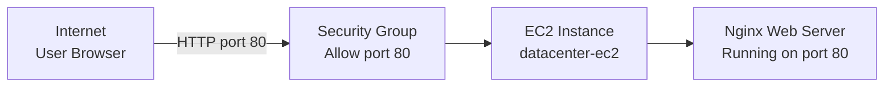

# Setting Up an EC2 Instance as an Nginx Web Server

## Problem Statement

The Nautilus DevOps team needs to set up a new web server for a critical application. The instance will be part of the initial infrastructure setup for the Nautilus project. Ensuring that the server is correctly configured and accessible from the internet is crucial for the upcoming deployment phase.

As a member of the Nautilus DevOps Team, your task is to perform the following:

- Launch an Ubuntu EC2 instance named `datacenter-ec2`.
- Configure a user data script to install the Nginx package and start the Nginx service automatically on launch.
- Create a security group that allows HTTP traffic on port 80 from the internet.
- Verify the instance and Nginx configuration.

The commands below use the AWS CLI and assume that credentials with permissions for EC2 and SSM Parameter Store are already configured.

## Prerequisites & Architecture Overview

- AWS Region: `us-east-1` in the examples below
- AMI: Latest Ubuntu Server 22.04 LTS AMI from the AWS public SSM parameter
- Instance Name: `datacenter-ec2`
- Instance Type: `t2.micro`
- Security Group: Allow inbound TCP port 80 from `0.0.0.0/0`
- User Data Script: Install and start Nginx

When a user sends an HTTP request from their browser, it reaches the security group on port 80. The security group allows the traffic through to the EC2 instance, where Nginx handles the request and returns a response.



## Solution

### Method 1: AWS Management Console

#### Step 1: Create a Security Group

Go to the EC2 Console and click **Security Groups** under **Network & Security** in the left sidebar. Click **Create security group**.

Configure the security group as follows:

- **Security group name:** `datacenter-ec2-sg`
- **Description:** `Allow HTTP traffic on port 80 from the internet`
- **VPC:** Select the default VPC (or the required VPC)

Under **Inbound rules**, click **Add rule** and configure:

- **Type:** `HTTP`
- **Protocol:** `TCP` (auto-filled when HTTP is selected)
- **Port range:** `80` (auto-filled when HTTP is selected)
- **Source:** `Anywhere-IPv4` (`0.0.0.0/0`)
- **Description:** `HTTP from anywhere`

Leave **Outbound rules** as the default (all traffic allowed). Click **Create security group**.

#### Step 2: Launch the EC2 Instance (`datacenter-ec2`)

Go to the EC2 Console and click **Launch instance**.

Configure the instance as follows:

- **Name:** `datacenter-ec2`
- **Application and OS Images:** Click **Ubuntu**, then select **Ubuntu Server 22.04 LTS** (64-bit, x86)
- **Instance type:** `t2.micro` or another appropriate small instance type
- **Key pair:** Select an existing key pair, or choose **Proceed without a key pair** if SSH access is not required
- **Network settings:** Click **Edit**, then:
  - Select the default VPC and a public subnet
  - **Auto-assign public IP:** `Enable`
  - **Firewall (security groups):** Select **Select existing security group**
  - Choose the `datacenter-ec2-sg` security group created in Step 1
- **Storage:** Keep the default root volume unless the application requires additional storage

Expand **Advanced details** and scroll down to the **User data** field. Paste the following script:

```bash
#!/bin/bash
apt-get update -y
apt-get install -y nginx
systemctl start nginx
systemctl enable nginx
```

Review the configuration and click **Launch instance**. Copy the instance ID after the instance is created.

#### Step 3: Verify the Instance is Running

Open the EC2 Console and go to **Instances**. Find the instance named `datacenter-ec2`.

Wait until the **Instance state** changes to **Running** and the **Status checks** show **2/2 checks passed**. Copy the **Public IPv4 address** from the instance details panel.

#### Step 4: Verify Nginx is Accessible

Open a web browser and navigate to `http://<Public-IPv4-Address>` (replace with the actual public IP from Step 3). You should see the **Welcome to nginx!** default page.

It may take 1–2 minutes after the instance reaches the Running state for the user data script to finish installing and starting Nginx. If you see a connection error, wait a moment and try again.

---

### Method 2: AWS CLI

#### 1. Check the AWS Region

Use the configured AWS region for the remaining AWS CLI commands.

```bash
aws configure get region
```

Example output:

```text
us-east-1
```

If the region is not set or you want to change it, export the desired region:

```bash
export AWS_DEFAULT_REGION=us-east-1
```

#### 2. Find the Latest Ubuntu AMI

Find the latest available Ubuntu 22.04 LTS AMI using the AWS public SSM parameter. AWS maintains these parameters so they always point to the latest AMI for each Ubuntu release.

```bash
UBUNTU_AMI=$(aws ssm get-parameters \
  --names /aws/service/canonical/ubuntu/server/22.04/stable/current/amd64/hvm/ebs-gp2/ami-id \
  --query "Parameters[0].Value" \
  --output text)

echo "Ubuntu AMI: $UBUNTU_AMI"
```

Example output:

```text
Ubuntu AMI: ami-0abcdef1234567890
```

The important flags are:

| Flag | Purpose |
|---|---|
| `--names` | The SSM parameter path that Canonical publishes for the latest Ubuntu 22.04 LTS AMI |
| `--query "Parameters[0].Value"` | Extracts only the AMI ID string from the JSON response |
| `--output text` | Returns the value as plain text so it can be stored in a variable |

Save the returned AMI ID for the next step. If the output is `None` or empty, check that the region is set correctly and that the SSM parameter path is valid.

#### 3. Create the Security Group

Create a security group in the default VPC to control inbound traffic to the instance. The security group name and description help identify its purpose later.

```bash
SG_ID=$(aws ec2 create-security-group \
  --group-name datacenter-ec2-sg \
  --description "Allow HTTP traffic on port 80 from the internet" \
  --query "GroupId" \
  --output text)

echo "Security Group ID: $SG_ID"
```

Example output:

```text
Security Group ID: sg-0abc123def456789a
```

The important flags are:

| Flag | Purpose |
|---|---|
| `--group-name` | Sets the name of the security group to `datacenter-ec2-sg` |
| `--description` | A human-readable description; this field is required by the API |
| `--query "GroupId"` | Extracts the security group ID from the JSON response |
| `--output text` | Returns the value as plain text for variable assignment |

Save the returned security group ID for the next steps.

#### 4. Add the HTTP Inbound Rule

Add an inbound rule to the security group that allows HTTP traffic (TCP port 80) from any IP address on the internet. Without this rule, no external HTTP traffic can reach the instance.

```bash
aws ec2 authorize-security-group-ingress \
  --group-id "$SG_ID" \
  --protocol tcp \
  --port 80 \
  --cidr 0.0.0.0/0
```

Example output:

```json
{
    "Return": true,
    "SecurityGroupRules": [
        {
            "SecurityGroupRuleId": "sgr-0abc123def456789a",
            "GroupId": "sg-0abc123def456789a",
            "IpProtocol": "tcp",
            "FromPort": 80,
            "ToPort": 80,
            "CidrIpv4": "0.0.0.0/0"
        }
    ]
}
```

The important flags are:

| Flag | Purpose |
|---|---|
| `--group-id` | The security group to modify (uses the ID saved in Step 3) |
| `--protocol tcp` | Specifies the TCP protocol for HTTP traffic |
| `--port 80` | Opens port 80, the standard HTTP port |
| `--cidr 0.0.0.0/0` | Allows traffic from any IPv4 address (the entire internet) |

Verify `"Return": true` in the output to confirm the rule was added successfully.

#### 5. Create the User Data Script

Create a shell script that will run automatically when the EC2 instance launches for the first time. This script updates the package index, installs Nginx, and starts the Nginx service.

```bash
cat <<'USERDATA' > userdata.sh
#!/bin/bash
apt-get update -y
apt-get install -y nginx
systemctl start nginx
systemctl enable nginx
USERDATA
```

Verify the file was created correctly:

```bash
cat userdata.sh
```

Expected output:

```text
#!/bin/bash
apt-get update -y
apt-get install -y nginx
systemctl start nginx
systemctl enable nginx
```

The script does the following:

| Line | Purpose |
|---|---|
| `#!/bin/bash` | Tells the system to execute this script using the Bash shell |
| `apt-get update -y` | Updates the package list; `-y` auto-confirms prompts |
| `apt-get install -y nginx` | Installs the Nginx web server package |
| `systemctl start nginx` | Starts the Nginx service immediately |
| `systemctl enable nginx` | Configures Nginx to start automatically on every boot |

#### 6. Launch the EC2 Instance

Launch the instance with the Ubuntu AMI, user data script, and security group configured in the previous steps. The `--tag-specifications` flag sets the instance name to `datacenter-ec2`.

```bash
INSTANCE_ID=$(aws ec2 run-instances \
  --image-id "$UBUNTU_AMI" \
  --instance-type t2.micro \
  --security-group-ids "$SG_ID" \
  --user-data file://userdata.sh \
  --tag-specifications 'ResourceType=instance,Tags=[{Key=Name,Value=datacenter-ec2}]' \
  --query "Instances[0].InstanceId" \
  --output text)

echo "Instance ID: $INSTANCE_ID"
```

Example output:

```text
Instance ID: i-0abc123def456789a
```

The important flags are:

| Flag | Purpose |
|---|---|
| `--image-id "$UBUNTU_AMI"` | Uses the Ubuntu AMI found in Step 2 |
| `--instance-type t2.micro` | Selects the `t2.micro` instance type (free-tier eligible) |
| `--security-group-ids "$SG_ID"` | Attaches the security group created in Step 3 |
| `--user-data file://userdata.sh` | Passes the Nginx install script; `file://` reads from the local file |
| `--tag-specifications` | Sets the `Name` tag to `datacenter-ec2` so it appears in the console |
| `--query "Instances[0].InstanceId"` | Extracts only the instance ID from the JSON response |
| `--output text` | Returns the value as plain text for variable assignment |

**Important:** Do not put a `$` before `INSTANCE_ID` on the left side of the `=`. In bash, variable assignment uses `VAR=$(command)`, not `$VAR=$(command)`.

Save the returned instance ID for the next steps.

#### 7. Wait for the Instance to be Running

Wait until the instance reaches the `running` state. The `aws ec2 wait` command blocks until the condition is met or times out.

```bash
aws ec2 wait instance-running --instance-ids "$INSTANCE_ID"
echo "Instance is now running."
```

Expected output:

```text
Instance is now running.
```

The `wait instance-running` command does not produce output on success. It returns only when the instance state changes to `running`. If the instance fails to start, the command will exit with an error after timing out.

#### 8. Get the Public IP Address

Retrieve the public IPv4 address assigned to the instance. This is the address you will use to access Nginx from a browser.

```bash
PUBLIC_IP=$(aws ec2 describe-instances \
  --instance-ids "$INSTANCE_ID" \
  --query "Reservations[0].Instances[0].PublicIpAddress" \
  --output text)

echo "Public IP: $PUBLIC_IP"
```

Example output:

```text
Public IP: 54.123.45.67
```

The important flags are:

| Flag | Purpose |
|---|---|
| `--instance-ids "$INSTANCE_ID"` | Filters the response to only the instance launched in Step 6 |
| `--query "Reservations[0].Instances[0].PublicIpAddress"` | Extracts only the public IP address from the nested JSON |
| `--output text` | Returns the value as plain text for variable assignment |

If the output is `None`, the instance may not have been assigned a public IP. Ensure the subnet has **Auto-assign public IPv4 address** enabled, or associate an Elastic IP.

#### 9. Verify Nginx is Accessible

Wait about 1–2 minutes for the user data script to complete the Nginx installation, then test the connection using `curl`.

```bash
curl http://$PUBLIC_IP
```

Expected output (truncated):

```html
<!DOCTYPE html>
<html>
<head>
<title>Welcome to nginx!</title>
...
</head>
<body>
<h1>Welcome to nginx!</h1>
<p>If you see this page, the nginx web server is successfully installed and
working. Further configuration is required.</p>
...
</body>
</html>
```

If you see the **Welcome to nginx!** HTML page, the setup is complete. The instance is running, Nginx is installed and serving traffic, and the security group is allowing HTTP connections on port 80.

If you get a `Connection refused` or `Connection timed out` error:

| Error | Likely cause | Fix |
|---|---|---|
| `Connection refused` | Nginx has not finished installing yet | Wait 1–2 minutes and retry |
| `Connection timed out` | Security group is not allowing port 80 | Check the inbound rules in Step 4 |
| `Could not resolve host` | The `$PUBLIC_IP` variable is empty or `None` | Re-run Step 8 to get the public IP |

---

## Verification Checklist

Open the EC2 Console and go to **Instances**. Find `datacenter-ec2` and confirm the following:

| Requirement | How to Verify |
|---|---|
| Instance name is `datacenter-ec2` | **Instances** → Name column shows `datacenter-ec2` |
| AMI is Ubuntu | Instance details → **AMI name** contains `ubuntu` |
| User data script was configured | Instance details → **Actions** → **Instance settings** → **Edit user data** shows the Nginx script |
| Security group allows HTTP on port 80 | **Security** tab → Inbound rules show `TCP` port `80` from `0.0.0.0/0` |
| Nginx is installed and running | Browse to `http://<Public-IP>` → Nginx welcome page appears |
