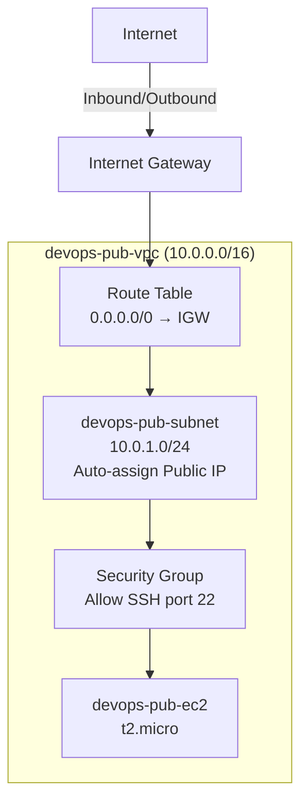

# Setting Up a Public VPC with an EC2 Instance for SSH Access

## Problem Statement

The Nautilus DevOps Team has received a request from the Networking Team to set up a new public VPC to support a set of public-facing services. This VPC will host various resources that need to be accessible over the internet.

As a member of the Nautilus DevOps Team, your task is to perform the following:

- Create a public VPC named `devops-pub-vpc`.
- Create a subnet named `devops-pub-subnet` under the same VPC with auto-assign public IP enabled.
- Create an EC2 instance named `devops-pub-ec2` under this VPC with instance type `t2.micro`.
- Ensure SSH port 22 is open for this instance and accessible over the internet.

The commands below use the AWS CLI and assume that credentials with permissions for VPC, EC2, and SSM Parameter Store are already configured.

## Prerequisites & Architecture Overview

- AWS Region: `us-east-1` in the examples below
- VPC Name: `devops-pub-vpc` | CIDR: `10.0.0.0/16`
- Subnet Name: `devops-pub-subnet` | CIDR: `10.0.1.0/24`
- Instance Name: `devops-pub-ec2` | Type: `t2.micro`
- AMI: Latest Ubuntu Server 22.04 LTS
- Security Group: Allow inbound TCP port 22 (SSH) from `0.0.0.0/0`



---

## Solution

### Method 1: AWS CLI

#### 1. Check the AWS Region

```bash
aws configure get region
```

Example output:

```text
us-east-1
```

If the region is not set or you want to change it:

```bash
export AWS_DEFAULT_REGION=us-east-1
```

#### 2. Create the VPC

```bash
VPC_ID=$(aws ec2 create-vpc \
  --cidr-block 10.0.0.0/16 \
  --query "Vpc.VpcId" \
  --output text)

echo "VPC ID: $VPC_ID"
```

Example output:

```text
VPC ID: vpc-0abc123def456789a
```

| Flag | Purpose |
|---|---|
| `--cidr-block 10.0.0.0/16` | Defines the IP address range for the VPC; `/16` gives 65,536 addresses |
| `--query "Vpc.VpcId"` | Extracts only the VPC ID from the JSON response |
| `--output text` | Returns the value as plain text for variable assignment |

Add the `Name` tag:

```bash
aws ec2 create-tags \
  --resources "$VPC_ID" \
  --tags Key=Name,Value=devops-pub-vpc
```

No output on success. `--resources` accepts any AWS resource ID, `--tags` sets key-value metadata on it.

#### 3. Enable DNS Hostnames on the VPC

```bash
aws ec2 modify-vpc-attribute \
  --vpc-id "$VPC_ID" \
  --enable-dns-hostnames '{"Value": true}'
```

No output on success. To verify:

```bash
aws ec2 describe-vpc-attribute \
  --vpc-id "$VPC_ID" \
  --attribute enableDnsHostnames \
  --query "EnableDnsHostnames.Value" \
  --output text
```

Expected output:

```text
True
```

| Flag | Purpose |
|---|---|
| `--enable-dns-hostnames '{"Value": true}'` | Allows instances with public IPs to get public DNS hostnames |

#### 4. Create the Subnet

```bash
SUBNET_ID=$(aws ec2 create-subnet \
  --vpc-id "$VPC_ID" \
  --cidr-block 10.0.1.0/24 \
  --query "Subnet.SubnetId" \
  --output text)

echo "Subnet ID: $SUBNET_ID"
```

Example output:

```text
Subnet ID: subnet-0abc123def456789a
```

| Flag | Purpose |
|---|---|
| `--vpc-id "$VPC_ID"` | Places the subnet inside the VPC created in Step 2 |
| `--cidr-block 10.0.1.0/24` | Defines the IP range for this subnet; must be within the VPC's `10.0.0.0/16` |
| `--query "Subnet.SubnetId"` | Extracts only the subnet ID from the JSON response |

Add the `Name` tag:

```bash
aws ec2 create-tags \
  --resources "$SUBNET_ID" \
  --tags Key=Name,Value=devops-pub-subnet
```

#### 5. Enable Auto-Assign Public IP on the Subnet

```bash
aws ec2 modify-subnet-attribute \
  --subnet-id "$SUBNET_ID" \
  --map-public-ip-on-launch
```

No output on success. To verify:

```bash
aws ec2 describe-subnets \
  --subnet-ids "$SUBNET_ID" \
  --query "Subnets[0].MapPublicIpOnLaunch" \
  --output text
```

Expected output:

```text
True
```

| Flag | Purpose |
|---|---|
| `--map-public-ip-on-launch` | Every instance launched in this subnet automatically gets a public IPv4 address |

#### 6. Create an Internet Gateway

```bash
IGW_ID=$(aws ec2 create-internet-gateway \
  --query "InternetGateway.InternetGatewayId" \
  --output text)

echo "Internet Gateway ID: $IGW_ID"
```

Example output:

```text
Internet Gateway ID: igw-0abc123def456789a
```

Add the `Name` tag:

```bash
aws ec2 create-tags \
  --resources "$IGW_ID" \
  --tags Key=Name,Value=devops-pub-igw
```

#### 7. Attach the Internet Gateway to the VPC

```bash
aws ec2 attach-internet-gateway \
  --internet-gateway-id "$IGW_ID" \
  --vpc-id "$VPC_ID"
```

No output on success.

| Flag | Purpose |
|---|---|
| `--internet-gateway-id "$IGW_ID"` | The Internet Gateway to attach (created in Step 6) |
| `--vpc-id "$VPC_ID"` | The VPC to attach it to (created in Step 2) |

To verify:

```bash
aws ec2 describe-internet-gateways \
  --internet-gateway-ids "$IGW_ID" \
  --query "InternetGateways[0].Attachments[0].State" \
  --output text
```

Expected output:

```text
available
```

#### 8. Create a Route Table

```bash
RT_ID=$(aws ec2 create-route-table \
  --vpc-id "$VPC_ID" \
  --query "RouteTable.RouteTableId" \
  --output text)

echo "Route Table ID: $RT_ID"
```

Example output:

```text
Route Table ID: rtb-0abc123def456789a
```

Add the `Name` tag:

```bash
aws ec2 create-tags \
  --resources "$RT_ID" \
  --tags Key=Name,Value=devops-pub-rt
```

#### 9. Add a Public Route to the Route Table

This is the critical step that makes the subnet public.

```bash
aws ec2 create-route \
  --route-table-id "$RT_ID" \
  --destination-cidr-block 0.0.0.0/0 \
  --gateway-id "$IGW_ID"
```

Example output:

```json
{
    "Return": true
}
```

| Flag | Purpose |
|---|---|
| `--route-table-id "$RT_ID"` | The route table to add the route to (created in Step 8) |
| `--destination-cidr-block 0.0.0.0/0` | Matches all traffic not destined for the VPC's local CIDR; this is the "default route" to the internet |
| `--gateway-id "$IGW_ID"` | Sends matched traffic to the Internet Gateway (created in Step 6) |

Verify `"Return": true` in the output.

#### 10. Associate the Route Table with the Subnet

```bash
aws ec2 associate-route-table \
  --route-table-id "$RT_ID" \
  --subnet-id "$SUBNET_ID"
```

Example output:

```json
{
    "AssociationId": "rtbassoc-0abc123def456789a",
    "AssociationState": {
        "State": "associated"
    }
}
```

| Flag | Purpose |
|---|---|
| `--route-table-id "$RT_ID"` | The route table containing the public route |
| `--subnet-id "$SUBNET_ID"` | The subnet to associate with this route table |

Verify `"State": "associated"` in the output.

#### 11. Create a Key Pair for SSH Access

```bash
aws ec2 create-key-pair \
  --key-name devops-pub-key \
  --query "KeyMaterial" \
  --output text > devops-pub-key.pem

chmod 400 devops-pub-key.pem
```

To verify the file was created:

```bash
ls -l devops-pub-key.pem
```

Expected output:

```text
-r-------- 1 user user 1674 Oct  5 22:30 devops-pub-key.pem
```

| Flag | Purpose |
|---|---|
| `--key-name devops-pub-key` | Sets the name of the key pair in AWS |
| `--query "KeyMaterial"` | Extracts the private key content from the JSON response |
| `--output text` | Returns the private key as plain text so it can be saved to a file |
| `> devops-pub-key.pem` | Shell redirection — saves the output to a file |
| `chmod 400` | Restricts file permissions; SSH refuses keys that are readable by others |

**Important:** The private key is shown only once. If you lose this file, you cannot download it again.

#### 12. Create a Security Group for SSH Access

```bash
SG_ID=$(aws ec2 create-security-group \
  --group-name devops-pub-sg \
  --description "Allow SSH access on port 22 from the internet" \
  --vpc-id "$VPC_ID" \
  --query "GroupId" \
  --output text)

echo "Security Group ID: $SG_ID"
```

Example output:

```text
Security Group ID: sg-0abc123def456789a
```

| Flag | Purpose |
|---|---|
| `--group-name devops-pub-sg` | Sets the name of the security group |
| `--description` | Human-readable description; required by the API |
| `--vpc-id "$VPC_ID"` | Creates the security group inside `devops-pub-vpc` (not the default VPC) |
| `--query "GroupId"` | Extracts the security group ID from the JSON response |

#### 13. Add the SSH Inbound Rule

```bash
aws ec2 authorize-security-group-ingress \
  --group-id "$SG_ID" \
  --protocol tcp \
  --port 22 \
  --cidr 0.0.0.0/0
```

Example output:

```json
{
    "Return": true,
    "SecurityGroupRules": [
        {
            "SecurityGroupRuleId": "sgr-0abc123def456789a",
            "GroupId": "sg-0abc123def456789a",
            "IpProtocol": "tcp",
            "FromPort": 22,
            "ToPort": 22,
            "CidrIpv4": "0.0.0.0/0"
        }
    ]
}
```

| Flag | Purpose |
|---|---|
| `--group-id "$SG_ID"` | The security group to modify (created in Step 12) |
| `--protocol tcp` | SSH uses the TCP protocol |
| `--port 22` | SSH listens on port 22 by default |
| `--cidr 0.0.0.0/0` | Allows SSH from any IPv4 address (the entire internet) |

Verify `"Return": true` and `"FromPort": 22` in the output.

> **Security note:** In production, replace `0.0.0.0/0` with your specific IP (e.g., `203.0.113.50/32`) to limit SSH access.

#### 14. Find the Latest Ubuntu AMI

```bash
UBUNTU_AMI=$(aws ssm get-parameters \
  --names /aws/service/canonical/ubuntu/server/22.04/stable/current/amd64/hvm/ebs-gp2/ami-id \
  --query "Parameters[0].Value" \
  --output text)

echo "Ubuntu AMI: $UBUNTU_AMI"
```

Example output:

```text
Ubuntu AMI: ami-0abcdef1234567890
```

| Flag | Purpose |
|---|---|
| `--names` | SSM parameter path that Canonical publishes for the latest Ubuntu 22.04 LTS AMI |
| `--query "Parameters[0].Value"` | Extracts only the AMI ID string from the JSON response |
| `--output text` | Returns the value as plain text for variable assignment |

If the output is `None` or empty, check that the region is set correctly.

#### 15. Launch the EC2 Instance

```bash
INSTANCE_ID=$(aws ec2 run-instances \
  --image-id "$UBUNTU_AMI" \
  --instance-type t2.micro \
  --key-name devops-pub-key \
  --security-group-ids "$SG_ID" \
  --subnet-id "$SUBNET_ID" \
  --tag-specifications 'ResourceType=instance,Tags=[{Key=Name,Value=devops-pub-ec2}]' \
  --query "Instances[0].InstanceId" \
  --output text)

echo "Instance ID: $INSTANCE_ID"
```

Example output:

```text
Instance ID: i-0abc123def456789a
```

| Flag | Purpose |
|---|---|
| `--image-id "$UBUNTU_AMI"` | Uses the Ubuntu AMI found in Step 14 |
| `--instance-type t2.micro` | Selects `t2.micro` (free-tier eligible) |
| `--key-name devops-pub-key` | Uses the key pair created in Step 11 for SSH access |
| `--security-group-ids "$SG_ID"` | Attaches the security group created in Step 12 |
| `--subnet-id "$SUBNET_ID"` | Launches inside `devops-pub-subnet` (which is in `devops-pub-vpc`) |
| `--tag-specifications` | Sets the `Name` tag to `devops-pub-ec2` |
| `--query "Instances[0].InstanceId"` | Extracts only the instance ID from the JSON response |

**Important:** Do not put a `$` before `INSTANCE_ID` on the left side of `=`. Bash assignment uses `VAR=$(command)`, not `$VAR=$(command)`.

#### 16. Wait for the Instance to be Running

```bash
aws ec2 wait instance-running --instance-ids "$INSTANCE_ID"
echo "Instance is now running."
```

Expected output:

```text
Instance is now running.
```

The `wait` command blocks silently until the instance state becomes `running`, then returns. If the instance fails to start, it exits with an error after timing out.

#### 17. Get the Public IP Address

```bash
PUBLIC_IP=$(aws ec2 describe-instances \
  --instance-ids "$INSTANCE_ID" \
  --query "Reservations[0].Instances[0].PublicIpAddress" \
  --output text)

echo "Public IP: $PUBLIC_IP"
```

Example output:

```text
Public IP: 54.123.45.67
```

| Flag | Purpose |
|---|---|
| `--instance-ids "$INSTANCE_ID"` | Filters the response to only the instance launched in Step 15 |
| `--query "Reservations[0].Instances[0].PublicIpAddress"` | Extracts only the public IP from the nested JSON |
| `--output text` | Returns the value as plain text for variable assignment |

If the output is `None`, verify that Step 5 (auto-assign public IP) was completed.

#### 18. Verify SSH Access

```bash
ssh -i devops-pub-key.pem ubuntu@$PUBLIC_IP
```

If successful, you will see:

```text
Welcome to Ubuntu 22.04.x LTS (GNU/Linux ...)
ubuntu@ip-10-0-1-xxx:~$
```

If you get an error:

| Error | Likely Cause | Fix |
|---|---|---|
| `Connection timed out` | Security group not allowing port 22, or route table missing `0.0.0.0/0 → IGW` route | Verify Steps 9, 10, and 13 |
| `Permission denied (publickey)` | Wrong key file or wrong username | Use `-i devops-pub-key.pem` and `ubuntu@` (not `ec2-user@`) |
| `WARNING: UNPROTECTED PRIVATE KEY FILE!` | Key file permissions too open | Run `chmod 400 devops-pub-key.pem` |
| `No route to host` | Internet Gateway not attached to VPC | Verify Step 7 |
| `$PUBLIC_IP` is `None` | Instance has no public IP | Verify Step 5 |

---

### Method 2: AWS Management Console

#### Step 1: Create the VPC

1. Open **VPC Console** → **Your VPCs** → **Create VPC**.
2. Select **VPC only**.
3. Configure:
   - **Name tag:** `devops-pub-vpc`
   - **IPv4 CIDR block:** Select **IPv4 CIDR manual input**
   - **IPv4 CIDR:** `10.0.0.0/16`
   - **IPv6 CIDR block:** `No IPv6 CIDR block`
   - **Tenancy:** `Default`
4. Click **Create VPC**.

#### Step 2: Enable DNS Hostnames

1. Select `devops-pub-vpc` → **Actions** → **Edit VPC settings**.
2. Check **Enable DNS hostnames** → **Save**.

#### Step 3: Create the Subnet

1. **VPC Console** → **Subnets** → **Create subnet**.
2. Configure:
   - **VPC ID:** Select `devops-pub-vpc`
   - **Subnet name:** `devops-pub-subnet`
   - **Availability Zone:** Any AZ (e.g., `us-east-1a`)
   - **IPv4 subnet CIDR block:** `10.0.1.0/24`
3. Click **Create subnet**.

#### Step 4: Enable Auto-Assign Public IP

1. Select `devops-pub-subnet` → **Actions** → **Edit subnet settings**.
2. Check **Enable auto-assign public IPv4 address** → **Save**.

#### Step 5: Create and Attach an Internet Gateway

1. **VPC Console** → **Internet gateways** → **Create internet gateway**.
2. **Name tag:** `devops-pub-igw` → **Create**.
3. Click **Actions** → **Attach to VPC** → select `devops-pub-vpc` → **Attach**.

#### Step 6: Create a Route Table and Add a Public Route

1. **VPC Console** → **Route tables** → **Create route table**.
2. **Name:** `devops-pub-rt`, **VPC:** `devops-pub-vpc` → **Create**.
3. Select the route table → **Routes** tab → **Edit routes** → **Add route**:
   - **Destination:** `0.0.0.0/0`
   - **Target:** Internet Gateway → `devops-pub-igw`
4. **Save changes**.

#### Step 7: Associate the Route Table with the Subnet

1. Select `devops-pub-rt` → **Subnet associations** tab → **Edit subnet associations**.
2. Select `devops-pub-subnet` → **Save associations**.

#### Step 8: Create a Security Group for SSH

1. **VPC Console** → **Security Groups** → **Create security group**.
2. Configure:
   - **Name:** `devops-pub-sg`
   - **Description:** `Allow SSH access on port 22 from the internet`
   - **VPC:** `devops-pub-vpc`
3. **Inbound rules** → **Add rule**:
   - **Type:** `SSH` | **Port:** `22` | **Source:** `Anywhere-IPv4` (`0.0.0.0/0`)
4. **Create security group**.

#### Step 9: Launch the EC2 Instance

1. **EC2 Console** → **Launch instance**.
2. Configure:
   - **Name:** `devops-pub-ec2`
   - **AMI:** Ubuntu Server 22.04 LTS (64-bit, x86)
   - **Instance type:** `t2.micro`
   - **Key pair:** Select or create a key pair
   - **Network settings** → **Edit**:
     - **VPC:** `devops-pub-vpc`
     - **Subnet:** `devops-pub-subnet`
     - **Auto-assign public IP:** `Enable`
     - **Security group:** Select existing → `devops-pub-sg`
3. **Launch instance**.

#### Step 10: Verify

1. Wait for **Instance state** = **Running**, **Status checks** = **2/2 passed**.
2. Copy the **Public IPv4 address**.
3. SSH from your terminal:

```bash
ssh -i your-key.pem ubuntu@<Public-IPv4-Address>
```

---

## Verification Checklist

| Requirement | Where to Check | Expected Value |
|---|---|---|
| VPC named `devops-pub-vpc` | VPC Console → Your VPCs | Name = `devops-pub-vpc`, CIDR = `10.0.0.0/16` |
| Subnet named `devops-pub-subnet` | VPC Console → Subnets | Name = `devops-pub-subnet`, VPC = `devops-pub-vpc` |
| Auto-assign public IP enabled | VPC Console → Subnets → select subnet | Auto-assign public IPv4 = `Yes` |
| Internet Gateway attached | VPC Console → Internet gateways | State = `Attached`, VPC = `devops-pub-vpc` |
| Route table has public route | VPC Console → Route tables → Routes | `0.0.0.0/0` → `igw-xxx` |
| Route table associated with subnet | VPC Console → Route tables → Subnet associations | `devops-pub-subnet` listed |
| Security group allows SSH | EC2 Console → Security Groups → Inbound rules | TCP port `22` from `0.0.0.0/0` |
| Instance running with public IP | EC2 Console → Instances | Name = `devops-pub-ec2`, State = `Running` |
| SSH access works | `ssh -i key.pem ubuntu@<IP>` | Connection succeeds |

---

## Concepts & Theory

This section explains each AWS resource used in the solution. Read this to understand **what** each component is, **why** it is needed, and **what happens** if it is missing.

### What is a VPC?

A **VPC (Virtual Private Cloud)** is your own isolated network inside AWS. Every resource you create — instances, databases, load balancers — lives inside a VPC. Think of it as your private data center in the cloud.

The **CIDR block** (e.g., `10.0.0.0/16`) defines the range of private IP addresses available inside the VPC. A `/16` block gives you 65,536 addresses. A `/24` block gives 256 addresses.

Common CIDR blocks for VPCs:

| CIDR | Total IPs | Typical Use |
|---|---|---|
| `10.0.0.0/16` | 65,536 | Large environments with many subnets |
| `10.0.0.0/24` | 256 | Small environments or single-subnet setups |
| `172.16.0.0/16` | 65,536 | Alternative private range |

### What is a Subnet?

A **subnet** is a smaller network inside the VPC. It lives in one specific **Availability Zone** (AZ). You place your resources (like EC2 instances) inside subnets.

The subnet's CIDR block must be a subset of the VPC's CIDR block. For example, if the VPC is `10.0.0.0/16`, valid subnets could be `10.0.1.0/24`, `10.0.2.0/24`, etc.

AWS reserves **5 IP addresses** in every subnet:

| Reserved IP | Purpose |
|---|---|
| `10.0.1.0` | Network address |
| `10.0.1.1` | VPC router |
| `10.0.1.2` | DNS server |
| `10.0.1.3` | Reserved for future use |
| `10.0.1.255` | Broadcast address |

So a `/24` subnet (256 IPs) has **251 usable** addresses.

### What Makes a Subnet "Public" vs "Private"?

A subnet is **public** when all three conditions are met:

1. An **Internet Gateway** is attached to the VPC.
2. The subnet's **route table** has a route sending `0.0.0.0/0` to the Internet Gateway.
3. Resources in the subnet have **public IP addresses**.

A subnet is **private** when any of these conditions is missing. Private subnets are used for databases, internal services, and anything that should not be directly reachable from the internet.

### What is an Internet Gateway (IGW)?

An **Internet Gateway** is the bridge between your VPC and the public internet. Without it, nothing inside the VPC can communicate with the outside world (and vice versa).

Key properties:

- A VPC can have **only one** IGW attached at a time.
- An IGW is horizontally scaled, redundant, and highly available — you don't manage its capacity.
- Creating an IGW does **not** automatically connect it — you must attach it to a VPC.
- Attaching it alone is **not enough** — you also need a route pointing to it.

### What is a Route Table?

A **Route Table** contains rules (called **routes**) that tell AWS where to send network traffic. When an instance sends traffic, AWS checks the route table to decide where it should go.

Every VPC comes with a **main route table** that has only one route:

| Destination | Target |
|---|---|
| `10.0.0.0/16` | `local` |

This `local` route means "traffic going to any IP inside the VPC stays inside the VPC." This route cannot be removed.

To make a subnet public, you add a second route:

| Destination | Target |
|---|---|
| `10.0.0.0/16` | `local` |
| `0.0.0.0/0` | `igw-xxx` |

The `0.0.0.0/0` route means "any traffic NOT going to the VPC's local CIDR should be sent to the Internet Gateway." This is called the **default route**.

### What is a Security Group?

A **Security Group** acts as a virtual firewall for your instance. It controls what traffic is allowed **in** (inbound rules) and **out** (outbound rules).

Default behavior:

| Direction | Default |
|---|---|
| **Inbound** | All traffic **denied** |
| **Outbound** | All traffic **allowed** |

Security groups are **stateful**: if you allow an inbound request, the response is automatically allowed out, and vice versa. This means you only need to create a rule for the initiating direction.

### What is a Key Pair?

A **Key Pair** is used for secure SSH authentication. It consists of:

- **Public key** — stored by AWS, injected into the instance at launch.
- **Private key** (`.pem` file) — kept by you, used to prove your identity when connecting.

When you SSH into an instance, your SSH client uses the private key to prove that you are the owner of the corresponding public key. This eliminates the need for passwords.

The private key is shown **only once** when created. If you lose it, you must create a new key pair.

### What is an AMI?

An **AMI (Amazon Machine Image)** is a template that contains the operating system, software, and configuration needed to launch an instance. Think of it as a "snapshot" or "blueprint" for a virtual machine.

Common AMIs:

| AMI | OS | Default SSH User |
|---|---|---|
| Ubuntu Server 22.04 LTS | Ubuntu Linux | `ubuntu` |
| Amazon Linux 2023 | Amazon Linux | `ec2-user` |
| Windows Server 2022 | Windows | RDP (no SSH) |

### How All the Pieces Fit Together

```text
Internet
   │
   ▼
Internet Gateway (devops-pub-igw)
   │  ← attached to VPC
   ▼
VPC (devops-pub-vpc, 10.0.0.0/16)
   │
   ▼
Route Table (devops-pub-rt)
   │  ← route: 0.0.0.0/0 → IGW
   │  ← associated with subnet
   ▼
Subnet (devops-pub-subnet, 10.0.1.0/24)
   │  ← auto-assign public IP = enabled
   ▼
Security Group (devops-pub-sg)
   │  ← inbound: TCP port 22 from 0.0.0.0/0
   ▼
EC2 Instance (devops-pub-ec2, t2.micro)
   │  ← key pair: devops-pub-key
   │  ← public IP: assigned automatically
```

If you remove any one of these components, SSH access from the internet will break:

| Missing Component | What Breaks |
|---|---|
| Internet Gateway | VPC has no path to the internet |
| IGW-to-VPC attachment | IGW exists but is not connected to anything |
| `0.0.0.0/0` route | Traffic to the internet has no route to follow |
| Route table → subnet association | Subnet uses the main route table (which has no public route) |
| Auto-assign public IP | Instance has no address the internet can reach |
| Security group SSH rule | Inbound SSH traffic is blocked at the firewall |
| Key pair | SSH authentication fails (no way to prove identity) |
